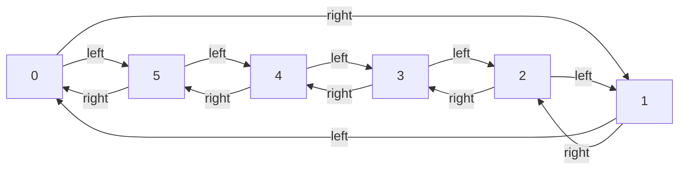

# Session 2024-11-3: Creating a random sequence to move on a cycle graph

**Objective:** Create a cyclic graph and, given input from a stack, traverse it to visit different nodes.

*Note:* These algorithms are part of a larger project about [VR teleportation.](https://github.com/DavidGiraldoCode/s-Evaluating_VR_teleportation_under_stressful_gameplay)

Steps
- Create a list $$L$$ containing numbers [-3, -2, -1, 1, 2, 3]. Each number tells how many steps to traverse in the graph, and the sign tells the direction in which to traverse.
- Create a graph $$G = (V,E)$$, where $$V$$ are the number of vertices and the $$E$$ the edge, that has $$n$$ nodes.
- Each vertex will have `[0,1]` values in its adjacency-list data structure, `0` representing the adjacent node to the left, and `1` to the right.
- The node at each vertex represents a color, so depending on the input given by $$L$$, the graph $$G$$ will print a color.

### Graph


### Takeaways
- The shuffle algorithm:
```C++
int random = 0;

int n = list.size();
for (size_t i = 0; i < n; i++)
{
    int min = i;
    int max = n - 1;
    int random = int(min + ((max - min) * (std::rand() / (RAND_MAX + 1.0f))));

    // Perform the classic swap using the temporal value
    int temp = list[i];
    list[i] = list[random];
    list[random] = temp;
}
```

- Creating a cycle graphcan be done in a fairly simple fashion, I was overcomplicating things. The constructor is as follows:

```C++
CycleGraph(int vertices)
{
    adjacency_list = vector<std::pair<int, int>>();
    m_vertices = vertices;

    for (size_t i = 0; i < m_vertices; i++)
    {
        int leftNode = ((m_vertices - 1) + i) % m_vertices;
        int rightNode = (i + 1) % m_vertices;
        std::pair<int, int> tuple = {leftNode, rightNode};

        adjacency_list.emplace_back(tuple);

        cout << "node: " << i << " left: " << adjacency_list[i].first << " right: " << adjacency_list[i].second << "\n";
    }
};
```
- This algorithm has a time complexity of $$O(n)$$
- The output yields:
```bash
node: 0 left: 5 right: 1
node: 1 left: 0 right: 2
node: 2 left: 1 right: 3
node: 3 left: 2 right: 4
node: 4 left: 3 right: 5
node: 5 left: 4 right: 0
```
- Recall that `vector<T>` cannot store raw arrays since the latter does not manage memory safely. Use `std::pair<int, int>` or `std::array<int, 2>` instead.
- Use `emplace_back()` instead of `push_back`

> ### Item 42: Consider emplacement instead of insertion
> What makes it possible for emplacement functions to outperform insertion functions is their more flexible interface. Insertion functions take objects to be inserted, while emplacement functions take constructor arguments for objects to be inserted. This difference permits emplacement functions to avoid the creation and destruction of temporary objects that insertion functions can necessitate.” ([Meyers, 2014, p. 294](zotero://select/library/items/DQ8TFDB6)) ([pdf](zotero://open-pdf/library/items/NY5GJB8F?page=312)).
> 
> [1] S. Meyers, Effective modern C++: 42 specific ways to improve your use of C++11 and C++14, First edition. Beijing ; Sebastopol, CA: O’Reilly Media, 2014.
